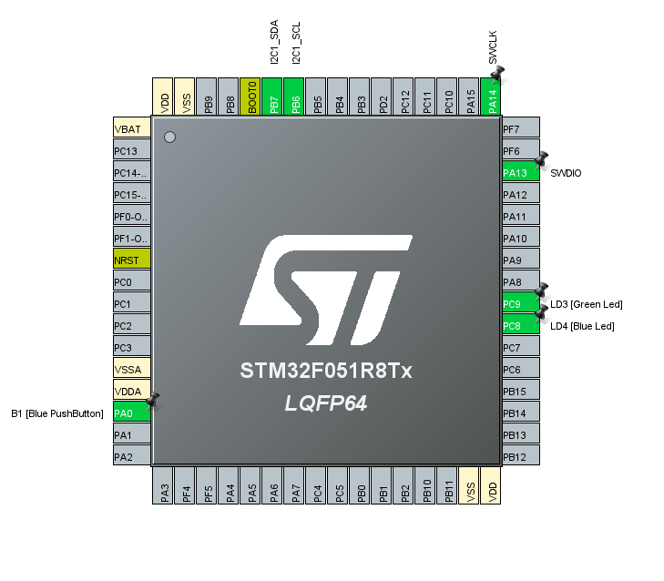
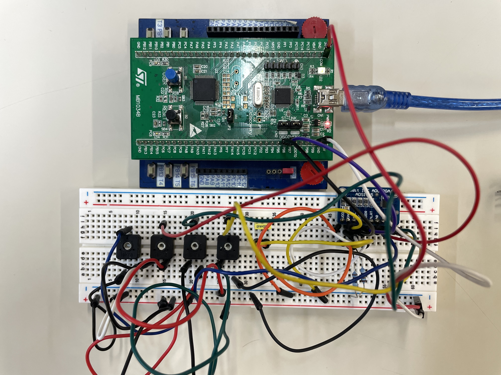

# Vaja 8–I2C povezava z ADS1115 16-bit ADC pretv. terSTM32F0 Discovery
 
## Cilj naloge:

S pomočjo STM32CubeIDEin HAL knjižnicamisprogramirajte mikroprocesor tako, da bo preko I2C protokola prebral in prikazal analogne vrednosti iz 4-kanalnega ADC pretvornika ADS1115. Potrebujete tudi 4 trimerje/potenciometre, upore in kondenzator.Za prikaz spremenljivk potrebujete STMStudio(ali STM32CubeIDE v Debugnačinu).

## Postopek inicilizacije
- prižgeta se pina **PB7** in **PB6**.
- Omogoča **dve** različni komunikaciji.
- | ADS 1115: 	| SCL     	| SDA     	| ADDR                                                                 	| ALRT         	| VDD           	|
  |-----------	|---------	|---------	|----------------------------------------------------------------------	|--------------	|---------------	|
  | STM32F0:  	| **PB6** 	| **PB7** 	| **Je povezan na GND Nato pa se preko  kondenzatorja(100nF) na +3.3V**  	| (ni povezan) 	| 5 V ali 3.3 V 	|
- SDA in SCL sta povezna durg preg drugega z dvema 10kΩ med tema dvema uporamo je priključena napetost +3.3 V.
- Frekvenca znaša 400KHz.
- 1001000 = **48** HEX.

## Pinout

## Video

https://user-images.githubusercontent.com/105905709/208051510-2de343cb-afa7-4bbf-b328-fc06aabe66ac.mp4

## Slika vezja

/>
